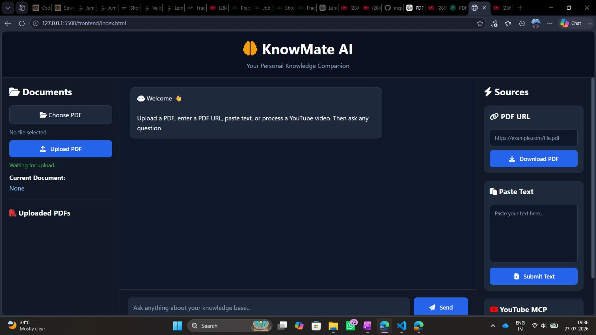
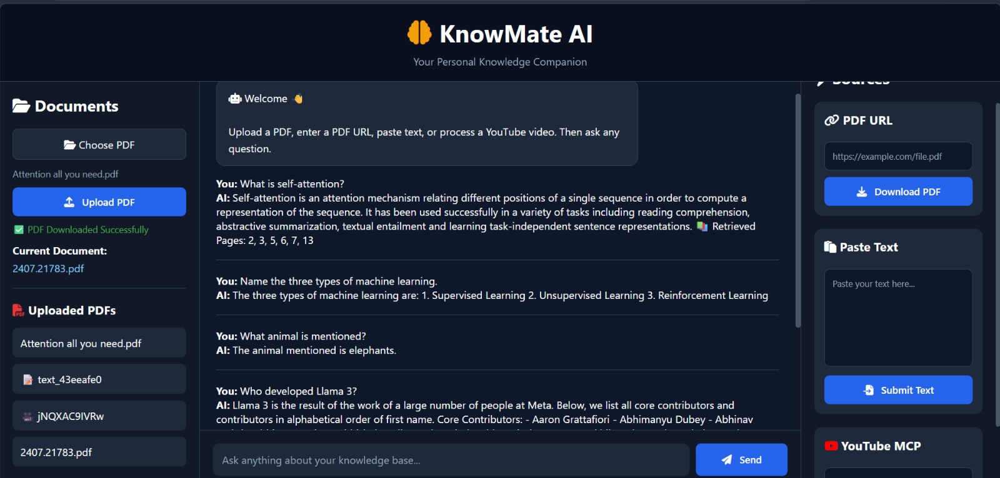

# 🧠 KnowMate AI

> **A Multi-Source Retrieval-Augmented Generation (RAG) Assistant built with LangGraph, FastAPI, FAISS, Groq, and MCP.**

KnowMate AI is an AI-powered Retrieval-Augmented Generation (RAG) assistant that enables users to interact with multiple knowledge sources through natural language. It supports PDF documents, PDF URLs, YouTube videos, and custom text, retrieves relevant information using semantic search, and generates context-aware responses using Large Language Models.

---

## ✨ Features

- 📄 Chat with local PDF documents
- 🌐 Process PDF documents directly from URLs
- ▶️ Chat with YouTube videos using transcript extraction (MCP)
- 📝 Query custom pasted text
- 🔍 Semantic search using FAISS
- 🤖 AI-powered responses using Groq LLM
- 🔄 Workflow orchestration using LangGraph
- ⚡ Backend powered by FastAPI
- 📚 Context-aware document retrieval

---

## 📸 Screenshots

### 🏠 Home



---

### 💬 Chat Demo



---

## 🛠️ Tech Stack

| Category | Technology |
|----------|------------|
| Language | Python |
| Framework | FastAPI |
| Workflow | LangGraph |
| LLM | Groq |
| Embeddings | Sentence Transformers |
| Vector Database | FAISS |
| PDF Processing | PyMuPDF |
| AI Framework | LangChain |
| Integration | MCP (Model Context Protocol) |

---

## 📂 Project Structure

```text
KnowMate-AI
│
├── app
│   ├── api
│   ├── core
│   ├── graph
│   ├── mcp
│   ├── prompts
│   ├── schemas
│   ├── services
│   └── main.py
│
├── frontend
├── mcp
├── requirements.txt
├── .env.example
└── README.md
```

---

## 🚀 Installation

Clone the repository

```bash
git clone https://github.com/ayushraviraj/KnowMate-AI.git
```

Move into the project directory

```bash
cd KnowMate-AI
```

Create a virtual environment

```bash
python -m venv .venv
```

Activate the virtual environment

### Windows

```bash
.venv\Scripts\activate
```

Install dependencies

```bash
pip install -r requirements.txt
```

---

## 🔑 Environment Variables

Create a `.env` file in the project root.

```env
GROQ_API_KEY=your_groq_api_key
```

---

## ▶️ Run the Application

Start the FastAPI server

```bash
python -m uvicorn app.main:app --reload
```

Then open `frontend/index.html` in your browser.

---

## 📌 Supported Knowledge Sources

- 📄 Local PDF Documents
- 🌐 PDF URLs
- ▶️ YouTube Videos
- 📝 Custom Text

---

## 🔮 Future Improvements

- Multi-LLM Support
- Persistent Vector Database
- Conversation Memory
- Authentication
- Docker Support
- Cloud Deployment
- Streaming Responses

---

## 👨‍💻 Author

**Ayush Raviraj**

- GitHub: https://github.com/ayushraviraj

---

## ⭐ Support

If you found this project useful, consider giving it a ⭐ on GitHub.
